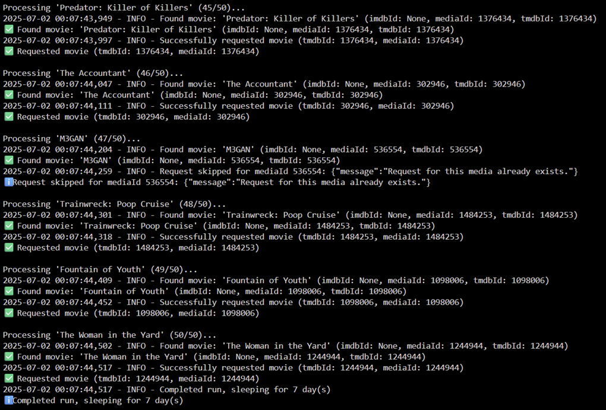

# Jelly Request

**Jelly Request** keeps your media library up## How It Works

Here's the step-by-step of what Jelly Request does behind the scenes:

1. **Checks IMDb**: Every week (or your chosen interval), it grabs a list of trending movies from IMDb.
2. **Compares to your library**: It talks to Jellyseerr to see which of those movies you're missing.
3. **Requests the good stuff**: Any movies not in your collection get added to your Jellyseerr requests.
4. **Repeats on schedule**: It keeps this up quietly in the background, so your library stays fresh.

**Here's what it looks like when running:**



*The app shows real-time progress as it processes each movie, finds matches, and successfully requests them in Jellyseerr.
to-date by automatically adding the top trending movies from IMDb to Jellyseerr. You don't have to search for what's popular—the app does it for you.*
---

## What It Does

- **Finds trending movies**: Pulls a list of popular movies straight from IMDb.
- **Adds them to Jellyseerr**: Requests movies you don’t already have in your library.
- **Runs on its own**: Once you set it up, it keeps going without any extra effort from you.

---

## How to Install

**For Unraid Users**

Here’s how to get Jelly Request up and running on Unraid:

1. Open the **Apps** tab in your Unraid dashboard.
2. Search for "Jelly Request" in the Community Apps store.
3. Click **Install** to add it to your Docker containers.
4. Fill in these two key settings:
   - **Jellyseerr URL**: The address where your Jellyseerr is running (e.g., `http://192.168.0.29:5054`). You can find this by visiting Jellyseerr in your browser and copying the URL (minus any extra paths like `/settings`).
   - **API Key**: Head to Jellyseerr > **Settings** > **General**, and copy the API key listed there. Paste it into the field.
5. Leave the other settings alone—they come pre-configured with sensible defaults (like checking IMDb every week).
6. Hit **Apply**, and you’re good to go!

> **Pro Tip**: If your Jellyseerr is on the same Unraid server, you might use something like `http://localhost:5054` or your server’s IP. Just make sure Jelly Request can reach it!

**For Docker Compose Users**

If you're not using Unraid and want to set up Jelly Request using Docker Compose, follow these steps:

1. **Clone the Repository**:
   ```bash
   git clone https://github.com/tophat17/jelly-request.git
   cd jelly-request
   ```

2. **Edit the `docker-compose.yml` File**:
   - Open `docker-compose.yml` in a text editor.
   - Update the following environment variables:
     - `JELLYSEERR_URL`: Your Jellyseerr instance URL (e.g., `http://192.168.0.29:5054`).
     - `API_KEY`: Your Jellyseerr API key (from Jellyseerr settings).
     - `MOVIE_LIMIT`: Number of movies to scrape (default: 50).
     - `RUN_INTERVAL_DAYS`: How often to run (default: 7 days).
     - `DEBUG_MODE`: Set to `SIMPLE` or `VERBOSE` (default: `SIMPLE`).

3. **Run Docker Compose**:
   ```bash
   docker-compose up -d --build
   ```

4. **Check Logs**:
   ```bash
   docker logs jelly-request
   ```

> **Note**: Make sure your Docker host can access Jellyseerr and IMDb. Adjust volume mappings in `docker-compose.yml` if you want to store logs elsewhere.

---

## How It Works

Here’s the step-by-step of what Jelly Request does behind the scenes:

1. **Checks IMDb**: Every week (or your chosen interval), it grabs a list of trending movies from IMDb.
2. **Compares to your library**: It talks to Jellyseerr to see which of those movies you’re missing.
3. **Requests the good stuff**: Any movies not in your collection get added to your Jellyseerr requests.
4. **Repeats on schedule**: It keeps this up quietly in the background, so your library stays fresh.

---

## Customizing Movie Lists

**Want movies from different countries or genres?** You can customize the IMDb URL to scrape any list you want:

### Popular Examples:
- **French Movies**: `https://www.imdb.com/search/title/?title_type=feature&primary_language=fr&sort=popularity,desc`
- **Indian Movies**: `https://www.imdb.com/india/top-rated-indian-movies/`
- **Top 250 Movies**: `https://www.imdb.com/chart/top/`
- **Horror Movies**: `https://www.imdb.com/search/title/?genres=horror&sort=popularity,desc`
- **Movies from 2024**: `https://www.imdb.com/search/title/?release_date=2024&sort=popularity,desc`

### How to Change:
1. **In Unraid**: Edit your container and change the **IMDb URL** field
2. **In Docker Compose**: Update the `IMDB_URL` environment variable

### Finding More Lists:
1. Go to [IMDb.com](https://www.imdb.com) 
2. Browse to any movie list or use the advanced search
3. Copy the URL and paste it into your Jelly Request configuration
4. The app will automatically scrape whatever list you provide!

---

## If Something Goes Wrong

Running into trouble? Here are the most common fixes:

- **Movies aren’t showing up in Jellyseerr**:
  - Double-check your **Jellyseerr URL**. Make sure it’s exact (e.g., no trailing slashes like `/` at the end unless needed).
  - Verify your **API key**. Copy it fresh from Jellyseerr’s settings to rule out typos.
- **App won’t start**:
  - Ensure your Unraid server has internet access—Jelly Request needs to reach IMDb.
  - Check that Jellyseerr is running and accessible at the URL you provided.
- **Still stuck?** Peek at the logs:
  - Go to the **Docker** tab in Unraid.
  - Find "Jelly Request," click it, and select **Logs**.
  - Look for error messages (like “connection failed” or “invalid key”) to get a clue.
- **Need more help?** Head to the [GitHub page](https://github.com/tophat17/jelly-request) to ask a question.

---

**License**: This project is licensed under the MIT License. See the [LICENSE](LICENSE) file for details.
